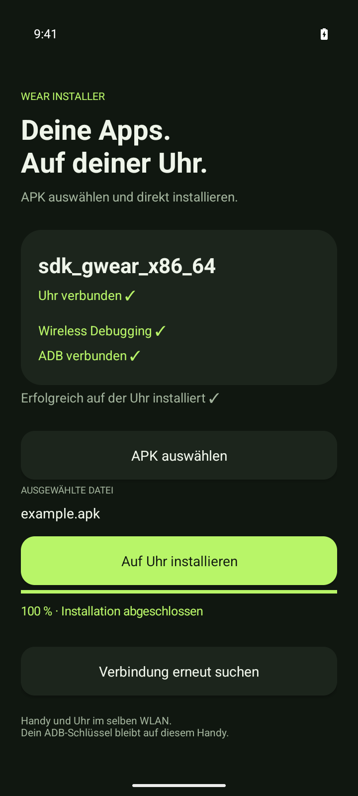

# Wear Installer

Zwei native Android-Apps: Das Handy installiert eine ausgewählte APK direkt über Wireless ADB auf einer Wear-OS-Uhr. Die kleine Uhr-App meldet ausschließlich ihre Identität und WLAN-Adresse über die Wear OS Data Layer API.



## Installation und Bedienung

1. `wearinstaller-phone-1.0.0.apk` auf dem Handy installieren.
2. `wearinstaller-watch-1.0.0.apk` einmal auf der Uhr installieren, etwa über einen Computer mit ADB. Die Uhr-App muss bereits vorhanden sein, damit das Handy die Uhr erkennt.
3. Die Uhr mit der offiziellen Begleit-App mit dem Handy verbinden. Beide Geräte ins gleiche WLAN bringen.
4. Wear Installer auf dem Handy öffnen. Die Uhr wird automatisch erkannt. Die Uhr-App kann auf Anfragen auch im Hintergrund antworten.
5. Beim ersten Mal auf der Uhr **Einstellungen → Entwickleroptionen → Wireless Debugging → Gerät mit Kopplungscode koppeln** öffnen. Auf englischen Uhren heißt der letzte Eintrag „Pair new device“.
6. Nur den sechsstelligen Code am Handy eingeben und **Koppeln** drücken. IP und beide Ports werden automatisch gefunden.
7. **APK auswählen** öffnet den Android File Picker. Danach **Auf Uhr installieren** drücken.

Bei späteren Starts erfolgt die Verbindung automatisch mit demselben ADB-Schlüssel. Verbindungsports werden niemals gespeichert. Nach einem Portwechsel sucht die App automatisch weiter. Wireless Debugging muss auf der Uhr weiterhin aktiv sein. Wenn Android es nach einem Neustart oder Netzwerkwechsel ausschaltet, muss der Nutzer es wieder einschalten; eine normale App kann das nicht selbst aktivieren.

## Voraussetzungen

- Handy: Android 11 / API 30 oder neuer, Google Play-Dienste und die passende offizielle Wear-OS-Begleit-App.
- Uhr: Wear OS mit **TLS Wireless Debugging und Pairing-Code**, typischerweise Wear OS 4 oder neuer. Ältere Uhren mit ausschließlich unverschlüsseltem TCP-ADB werden nicht unterstützt.
- Dasselbe lokale IPv4-WLAN, in dem mDNS/Multicast und Geräteverbindungen erlaubt sind. Gastnetze mit Client-Isolation verhindern die Verbindung.
- Einzelne, eigenständig installierbare `.apk`-Dateien. Split-APK-Pakete (`.apks`, `.apkm`, `.xapk`) werden nicht unterstützt.

## Projekt

| Modul | Aufgabe |
| --- | --- |
| `mobile` | Oberfläche, File Picker, mDNS, TLS-Pairing, Schlüssel und ADB-Installation |
| `wear` | Gerätename, Modell, aktuelle WLAN-IP, Verbindungsstatus |
| `common` | Nachrichtenprotokoll und kleine native UI-Helfer |
| `libadb` | LibADB Android 3.1.1 mit begrenzten Netzwerkwartezeiten |
| `test-apk` | Installierbare Test-App mit generiertem 4-MiB-Asset |

Beide Apps verwenden `dev.ghostcode.wearinstaller`, denselben Versionscode und denselben Signing-Key. Die Watch- und Phone-Capabilities identifizieren die passenden Apps. Bei mehreren Uhren wählt die App zunächst eine nahe Uhr; **Andere Uhr wählen** speichert eine bewusste Auswahl.

Das Handy fordert regelmäßig eine frische Antwort mit einem zufälligen Nonce an und akzeptiert nur die ausgewählte Data-Layer-Node. Die Uhr ermittelt ihre aktuelle IPv4-Adresse aus den WLAN-LinkProperties. Zusätzlich veröffentlicht sie einen dringenden DataItem; die Handy-Verbindung verwendet ausschließlich frische Antworten, damit ein alter DataItem keine Installation auf eine veraltete IP auslöst.

NSD sucht nach `_adb-tls-connect._tcp` und `_adb-tls-pairing._tcp`. Aufgelöste Adressen müssen exakt zur IP der ausgewählten Uhr passen. Portinformationen bleiben im Arbeitsspeicher. Dienstverlust, geänderte IP und geänderte Ports führen zu erneuter Suche.

Die RSA-ADB-Identität liegt AES-GCM-verschlüsselt im privaten `no_backup`-Verzeichnis des Handys. Der nicht exportierbare AES-Schlüssel liegt im Android Keystore. Backup ist deaktiviert. Der Pairing-Code wird nicht gespeichert. Die Uhr enthält keine ADB-Bibliothek, führt keine Shell-Kommandos aus und installiert keine APKs.

Die Handy-App kopiert die File-Picker-Datei in ihren privaten Cache, prüft den APK-Container, überträgt sie in Blöcken über ADB `sync:`, führt auf `adbd` `pm install -r` aus und prüft die Erfolgsmeldung zusammen mit dem Exit-Status. Die temporäre Datei auf der Uhr wird anschließend entfernt. Die Installation hat eine Grenze von drei Minuten. Eine unterbrochene Installation wird nicht automatisch wiederholt.

## Bauen und prüfen

Java 17, Android SDK Platform 35 und die SDK Build Tools installieren. `ANDROID_HOME` setzen oder `sdk.dir` in einer lokalen, nicht eingecheckten `local.properties` angeben.

```bash
./gradlew :mobile:assembleDebug :wear:assembleDebug :test-apk:assembleDebug
./gradlew :common:testDebugUnitTest :mobile:testDebugUnitTest :libadb:testDebugUnitTest :mobile:lintDebug :wear:lintDebug
```

Die Debug-APKs beider Module werden mit demselben Android-Debug-Key signiert. Release- und Debug-APKs dürfen für die Data Layer nicht gemischt werden.

Für Release-Builds einen gemeinsamen Keystore über diese Variablen bereitstellen:

```bash
export WEARINSTALLER_KEYSTORE=/sicherer/pfad/release.p12
export WEARINSTALLER_STORE_PASSWORD='dein-passwort'
./scripts/build-release.sh
```

Der Alias ist `wearinstaller`. Alternativ eine ignorierte `signing.properties` im Projekt anlegen:

```properties
storeFile=/sicherer/pfad/release.p12
storePassword=dein-passwort
keyAlias=wearinstaller
keyPassword=dein-passwort
```

Auf dem ursprünglichen Build-Host liegen Keystore und Passwort außerhalb des Repositories unter `~/.local/share/wearinstaller/signing/`. Diese Dateien sicher aufbewahren: Ohne denselben Signing-Key sind später keine Updates der Release-APKs möglich. Das Repository und die Release-Assets enthalten keine privaten Schlüssel.

`scripts/build-release.sh` führt Tests und Release-Lint aus und erzeugt beide signierten APKs sowie `SHA256SUMS` unter `artifacts/v1.0.0/`. Die GitHub-Actions-Konfiguration baut und prüft Debug-APKs ohne Release-Zugangsdaten.

## Tests und Quellen

Der tatsächlich ausgeführte Zwei-Geräte-Test, Screenshots und Grenzen der Emulatorprüfung stehen in [docs/TESTING.md](docs/TESTING.md).

- [Google: Data Layer API, identischer Paketname und Signatur](https://developer.android.com/training/wearables/data/overview)
- [Google: Wear-Emulator mit Handy verbinden](https://developer.android.com/training/wearables/get-started/connect-phone)
- [Google: gemeinsames Emulator-WLAN und NSD](https://developer.android.com/studio/run/emulator-networking-interconnect)
- [Google: Network Service Discovery](https://developer.android.com/develop/connectivity/wifi/use-nsd)
- [LibADB Android](https://github.com/MuntashirAkon/libadb-android), lokale Anpassungen und Lizenzen in [libadb/UPSTREAM.md](libadb/UPSTREAM.md)

Eigener Anwendungscode: Apache-2.0. Drittanbieter behalten ihre jeweiligen Lizenzen; siehe [THIRD_PARTY_NOTICES.md](THIRD_PARTY_NOTICES.md).
